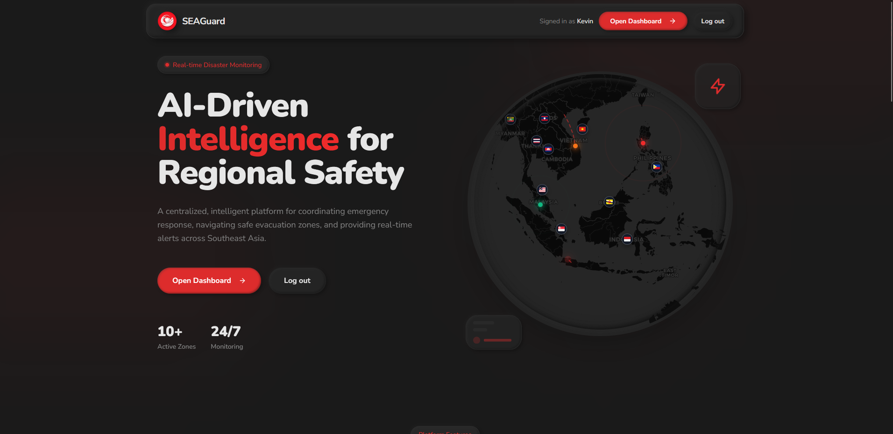
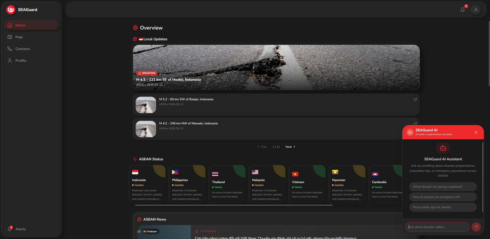
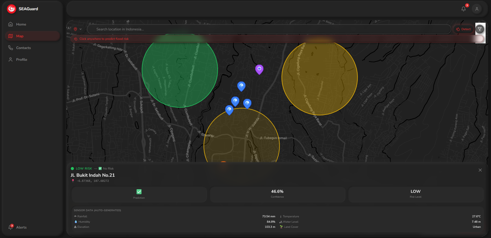
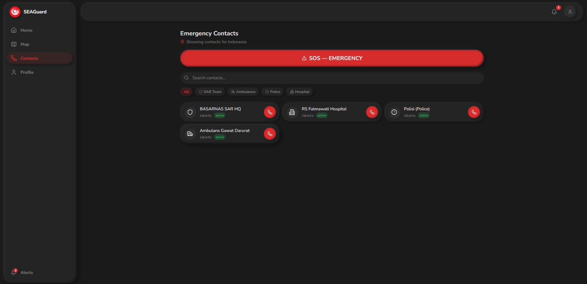
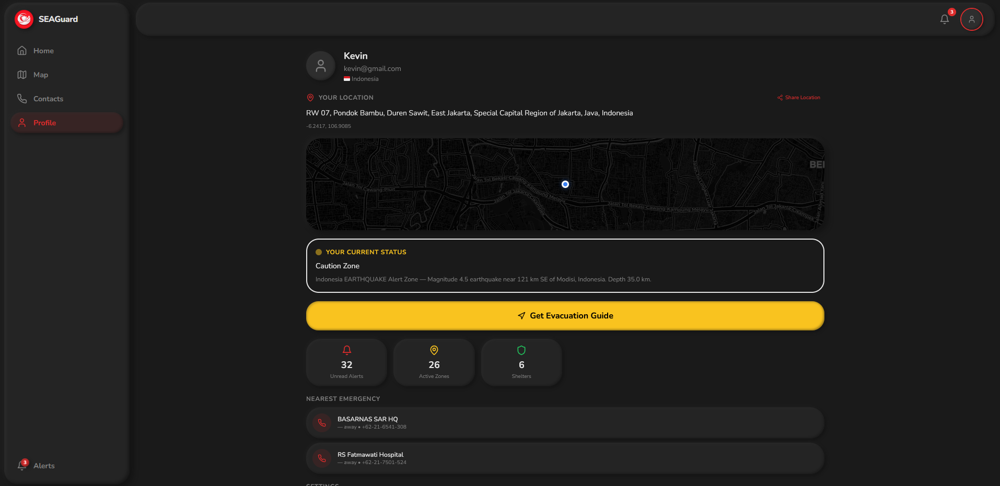

# SEAGuard

**Live Demo**: [seaguard.netlify.app](https://seaguard.netlify.app/)

**SEAGuard** is an AI-powered platform designed to enhance disaster preparedness and response across ASEAN. By leveraging artificial intelligence, geospatial mapping, and real-time data analysis, SEAGuard aims to provide localized risk forecasts, early warning alerts, and location-based evacuation guidance. Through these capabilities, the platform seeks to bridge existing gaps in disaster information systems and enable communities to make faster and more informed decisions when facing floods, landslides, and typhoon.

---

## Key Features

### Real-Time Disaster Monitoring
*   **Active Zones Map**: Interactive visualization of disaster zones (Evacuation, Caution, Danger).
*   **Global & Local Alerts**: Real-time push notifications and alerts.
*   **Risk Forecasts**: Data-driven predictions for upcoming environmental risks in the region.

### Advanced Navigation
*   **AR Navigation**: Augmented Reality guided evacuation routes to the nearest shelters.
*   **Emergency Shelters**: Instant identification and routing to the nearest safety points.

### Emergency Resources
*   **Global Emergency Contacts**: Quick access to maritime and local emergency services across ASEAN countries.
*   **AI Chatbot Assistant**: 24/7 intelligent assistance for safety queries and emergency guidance.
*   **Survival Guides**: Comprehensive, disaster-specific survival instructions available offline.

### Localization & Accessibility
*   **Multi-language Support**: Fully localized in English, Bahasa Indonesia, Filipino, Thai, Vietnamese, Malay, Burmese, Khmer, and Lao.
*   **User Setup**: Personalized experience based on user's location and preferred language.

---

## Tech Stack

### Frontend
*   **Framework**: [React 18](https://reactjs.org/) with [TypeScript](https://www.typescriptlang.org/)
*   **Build Tool**: [Vite](https://vitejs.dev/)
*   **Styling**: [Tailwind CSS](https://tailwindcss.com/)
*   **UI Components**: [shadcn/ui](https://ui.shadcn.com/) (Radix UI primitives)
*   **State Management**: [TanStack Query (React Query)](https://tanstack.com/query/latest)
*   **Routing**: [React Router DOM v6](https://reactrouter.com/)
*   **Icons**: [Lucide React](https://lucide.dev/)
---

## Project Structure

```text
src/
 ├── components/       # Reusable UI components (shadcn/ui + custom)
 ├── contexts/         # React Contexts (Auth, Translation, Preferences)
 ├── data/             # Mock data and constants
 ├── hooks/            # Custom React hooks
 ├── lib/              # API services and utility functions (api.ts, utils.ts)
 ├── pages/            # Main application screens/routes
 └── test/             # Test configuration and setup
```

---

## Environment Variables

Create a `.env` file in the root directory and add the following:

```env
# Backend API base URL
VITE_BACKEND_URL=your_backend_api_url_here

# Google Maps API Key for location services
VITE_GOOGLE_MAPS_API_KEY=your_api_key_here
```

---

## Installation

Ensure you have [Node.js](https://nodejs.org/) installed.

```bash
# Install dependencies
npm install
```

---

## Running Locally

```bash
# Start development server
npm run dev
```
The application will be available at `http://localhost:5173`.

---

## Build for Production

```bash
# Build the project
npm run build

# Preview production build
npm run preview
```

---

## Screenshots

**Landing Page**


**Home**


**Maps**


**Contact**


**Profile**


---
